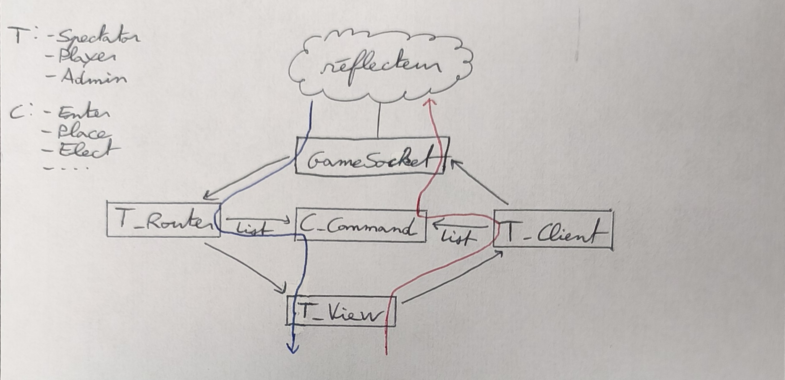

# carcassonne_connection_library

Une librairie Java standardisée pour connecter différents programmes (arbitre, robot, interface graphique) au réflecteur du projet Carcassonne.

---

## Table des matières

- [Pourquoi cette librairie ?](#pourquoi-cette-librairie-)
- [Installation](#installation)
- [Utilisation](#utilisation)
  - [Se connecter avec une interface basique](#se-connecter-avec-une-interface-basique)
  - [Créer sa propre interface (Joueur / Robot)](#créer-sa-propre-interface-joueur--robot)
  - [Créer un programme arbitre (Admin)](#créer-un-programme-arbitre-admin)
  - [Envoyer et recevoir des messages](#envoyer-et-recevoir-des-messages)
- [Gestion des rôles](#gestion-des-rôles)
- [Fonctionnement interne](#fonctionnement-interne)
  - [Architecture générale](#architecture-générale)
  - [Flux d'envoi d'un message](#flux-denvoi-dun-message)
  - [Flux de réception d'un message](#flux-de-réception-dun-message)
  - [Étendre la librairie](#étendre-la-librairie)

---

## Pourquoi cette librairie ?

Dans le projet Carcassonne, plusieurs programmes indépendants — un arbitre, des robots joueurs et une interface graphique — doivent communiquer entre eux via un **réflecteur centralisé** en WebSocket. Sans outillage dédié, chaque programme devrait gérer manuellement la connexion réseau, le formatage des messages textuels et la validation des arguments. Cette approche est source d'erreurs, difficile à maintenir et expose des risques d'incohérence entre les différents programmes.

La `carcassonne_connection_library` résout ces problèmes en proposant un cadre de communication commun. Voici pourquoi vous devriez l'utiliser plutôt que de passer directement par le réflecteur :

**Un protocole de communication strict.** Chaque type de message est encapsulé dans une classe `Command` dédiée. Il est impossible d'envoyer un message mal formé — mauvais nombre d'arguments, mauvais types — sans qu'une exception Java soit levée au moment de la construction du message. Fini les bugs silencieux causés par une chaîne de caractères mal construite à la main. Pour en savoir plus sur les messages voir [message_carcassone](https://gitlab-etu.fil.univ-lille.fr/l3s6-projet-g6-star/participant_infos/-/blob/master/messages_carcassonne.md).

**Une sécurité par construction grâce aux rôles.** Un spectateur ne possède physiquement pas les méthodes pour envoyer un placement de tuile. Un joueur ne peut pas démarrer une partie. Ces contraintes sont imposées par la hiérarchie des classes, pas par des vérifications à l'exécution fragiles et faciles à contourner.

**Une modularité totale.** Ajouter un nouveau type de message au protocole se résume à écrire une seule nouvelle classe `Command`. Créer un nouveau programme (un deuxième type de robot, une interface alternative) ne demande que d'hériter de la classe `View` correspondante et de surcharger les méthodes qui vous intéressent. Chaque composant est indépendant et peut évoluer sans casser les autres.

**Une abstraction réseau complète.** En tant qu'utilisateur de la librairie, vous ne manipulez jamais de WebSocket, de threads ou de chaînes de caractères brutes. Vous appelez des méthodes métier comme `send("PLACES", tile, "N", 0, 0)` ou vous surchargez `updateOnOffer(...)` : c'est tout.

**Une maintenabilité accrue.** En centralisant la logique de communication dans une seule librairie partagée, toute correction de bug ou évolution du protocole bénéficie instantanément à tous les programmes qui l'utilisent, sans avoir à les modifier individuellement.

---

## Installation

### Compilation et installation locale

Clonez le dépôt et installez la librairie dans votre dépôt Maven local :

```bash
# Avec SSH
git clone git@gitlab-etu.fil.univ-lille.fr:l3s6-projet-g6-star/carcassonne_connection_library.git

# Avec HTTPS
git clone https://gitlab-etu.fil.univ-lille.fr/l3s6-projet-g6-star/carcassonne_connection_library.git

cd carcassonne_connection_library
mvn clean install
```

### Ajouter la dépendance à votre projet

Ajoutez la dépendance suivante dans le `pom.xml` de votre projet :

```xml
<dependency>
    <groupId>l3s6.projet.star</groupId>
    <artifactId>carcassonne_connection_library</artifactId>
    <version>1.0-SNAPSHOT</version>
</dependency>
```

---

## Utilisation

### Se connecter avec une interface basique

La librairie fournit trois exécutables JAR de test dans le dossier `target/`. Ils permettent de se connecter au réflecteur et d'interagir via la ligne de commande, sans écrire de code.

```bash
# Interface spectateur (lecture seule)
java -jar SpectatorMain.jar <Host IP> <Host Port>

# Interface joueur
java -jar PlayerMain.jar <Host IP> <Host Port> <Votre ID>

# Interface arbitre (accès complet)
java -jar AdminMain.jar <Host IP> <Host Port> <Votre ID>
```

### Créer sa propre interface (Joueur / Robot)

Pour créer votre propre programme joueur ou robot, créez une classe qui hérite de `PlayerView`. Vous n'avez qu'à surcharger les méthodes `updateOn...` correspondant aux événements qui vous intéressent.

```java
import l3s6.projet.star.interaction.view.PlayerView;
import l3s6.projet.star.interaction.network.PlayerClient;

public class MonRobot extends PlayerView<PlayerClient> {

    public MonRobot(String ip, int port, String id) throws Exception {
        super(ip, port, id);
    }

    /**
     * Appelé automatiquement lorsque l'arbitre vous propose une tuile à placer.
     */
    @Override
    public void updateOnOffer(String sourceId, String targetPlayer, String tile) {
        if (targetPlayer.equals(this.id)) {
            if (this.roleManager.isRole(sourceId, Role.REFEREE)){
                // Logique de décision ici...
                try {
                    // Envoyer une commande PLACES avec la tuile, l'orientation et les coordonnées
                    this.send("PLACES", this.id, "N", 0, 0);
                } catch (InvalidArgumentNumberException e) {
                    e.printStackTrace();
                }
            }
        }
    }

    /**
     * Appelé automatiquement lorsqu'un score est mis à jour.
     */
    @Override
    public void updateOnScore(String sourceId, String targetPlayer, int score) {
        System.out.println("Joueur " + targetPlayer + " a marqué " + score + " points.");
    }

    public static void main(String[] args) throws Exception {
        MonRobot robot = new MonRobot("localhost", 3000, "robot-1");
        // Le robot est maintenant connecté et réagit aux événements automatiquement.
    }
}
```

### Créer un programme arbitre (Admin)

Pour créer un programme arbitre, héritez de `AdminView`. Vous aurez accès à toutes les méthodes joueur, plus les commandes de contrôle de partie (`STARTS`, `ENDS`, `OFFERS`, `ELECTS`, `GRANTS`, `EXPELS`).

```java
import l3s6.projet.star.interaction.view.AdminView;
import l3s6.projet.star.interaction.network.AdminClient;

public class MonArbitre extends AdminView<AdminClient> {

    public MonArbitre(String ip, int port, String id) throws Exception {
        super(ip, port, id);
    }

    /**
     * Démarre la partie dès que la connexion est établie.
     */
    @Override
    protected void afterConnection() {
        try {
            this.send("STARTS");
        } catch (InvalidArgumentNumberException e) {
            e.printStackTrace();
        }
    }
}
```

### Envoyer et recevoir des messages

**Envoi :** utilisez la méthode `send` héritée de `AbstractView`, en passant le nom de la commande et ses arguments.

```java
// Placer une tuile sans meeple : id PLACES tile orientation x y
this.send("PLACES", myId, "E", 3, -2);

// Placer une tuile avec un meeple : id PLACES tile orientation x y meeple_type meeple_position
this.send("PLACES", myId, "E", 3, -2, "regular", "B0");

// Démarrer la partie (arbitre uniquement)
this.send("STARTS");
```

Si le nom de la commande est inconnu, ou si le nombre d'arguments est incorrect, une `InvalidArgumentNumberException` est levée.

**Réception :** les messages entrants sont traités automatiquement. Il vous suffit de surcharger les méthodes `updateOn...` dans votre classe. Voici les principales :

| Méthode à surcharger | Déclenchée quand... |
|---|---|
| `updateOnPlace(id, id', orientation, x, y)` | Un joueur place une tuile |
| `updateOnPlaceWithMeeple(id, id', orientation, x, y, meepleType, meeplePos)` | Un joueur place une tuile avec un meeple |
| `updateOnOffer(sourceId, targetPlayer, tile)` | L'arbitre vous propose une tuile |
| `updateOnScore(sourceId, targetPlayer, score)` | Un score est mis à jour |

---

## Gestion des rôles

La librairie organise les droits d'accès via une hiérarchie de classes. Chaque rôle hérite du précédent et étend ses capacités.

| Rôle | Classe View | Client associé | Capacités |
|---|---|---|---|
| **Spectateur** | `SpectatorView` | `SpectatorClient` | Reçoit toutes les mises à jour. Ne peut rien envoyer. |
| **Joueur** | `PlayerView` | `PlayerClient` | Hérite du Spectateur + peut envoyer `PLAYS`, `PLACES`, `AGREES`, `LEAVES`. |
| **Arbitre** | `AdminView` | `AdminClient` | Hérite du Joueur + peut envoyer `STARTS`, `ENDS`, `OFFERS`, `ELECTS`, `GRANTS`, `EXPELS`, `SCORE`, `BLAME`, `COLLECT`, `CLOSE`. |

Cette hiérarchie garantit qu'un programme joueur ne peut jamais, même par erreur, appeler des commandes réservées à l'arbitre : ces méthodes n'existent tout simplement pas dans sa classe.

En interne, la classe `RoleManager` maintient une cartographie des identifiants et de leurs rôles (`Role.PLAYER`, `Role.REFEREE`, `Role.SPECTATOR`, `Role.UTILITY`). Votre programme peut ainsi vérifier à tout moment le rôle d'un autre participant.

```java
// Récupérer le rôle d'un participant par son ID
Role role = this.getRoleManager().getRole("player-3");

// Vérifier qu'un participant est bien l'arbitre
boolean isReferee = this.getRoleManager().isRole("player-3", Role.REFEREE);
```

---

## Fonctionnement interne

Cette section s'adresse aux développeurs souhaitant comprendre ou étendre le code de la librairie.

### Architecture générale

La librairie repose sur quatre composants principaux qui collaborent selon un pattern **Command / Router** couplé à une architecture **Client / Vue**.



### Flux d'envoi d'un message

1. La *View* demande au *Client* qui lui est associé d'envoyer un message X (avec les éventuels arguments).
2. Le *Client* vérifie qu'il possède la commande X dans sa liste de *Command* (autrement dit que l'utilisateur a le droit  d'envoyer cette commande).
3. Dans ce cas le *Client* demande à la *Command* de s'envoyer sur le socket.
4. Si le nombre d'argument passé est bon, la *Command* construit le message correspondant et demande au socket de l'envoyer vers le réflecteur.

Si la commande n'existe pas dans la liste du client (droit non accordé par le rôle), ou si le nombre d'arguments est incorrect, une `InvalidArgumentNumberException` est levée avant tout envoi réseau.

### Flux de réception d'un message

1. Le socket reçoit un message du réflecteur et demande au *Router* de le traiter.
2. Le *Router* vérifie qu'il possède la commande Y dans sa liste de *Command* (autrement dit que l'utilisateur a le droit de recevoir cette commande).
3. Dans ce cas le *Routeur* demande à la *Command* d'éxécuter la méthode correspondante dans la *View*.
4. Si le nombre d'argument reçu est bon, la *Command* appelle la méthode *updateOnY(arguments)* de la *View*.

### Étendre la librairie

Pour ajouter le support d'un nouveau type de message au protocole, il suffit de :
1. Créer une nouvelle classe dans `interaction/command/` qui hérite de `AbstractCommand` et implémente `build()` et `execute()`.
2. Enregistrer cette commande dans le constructeur du `Client` concerné (pour l'envoi) et du `Router` concerné (pour la réception).

Aucun autre fichier n'a besoin d'être modifié.
